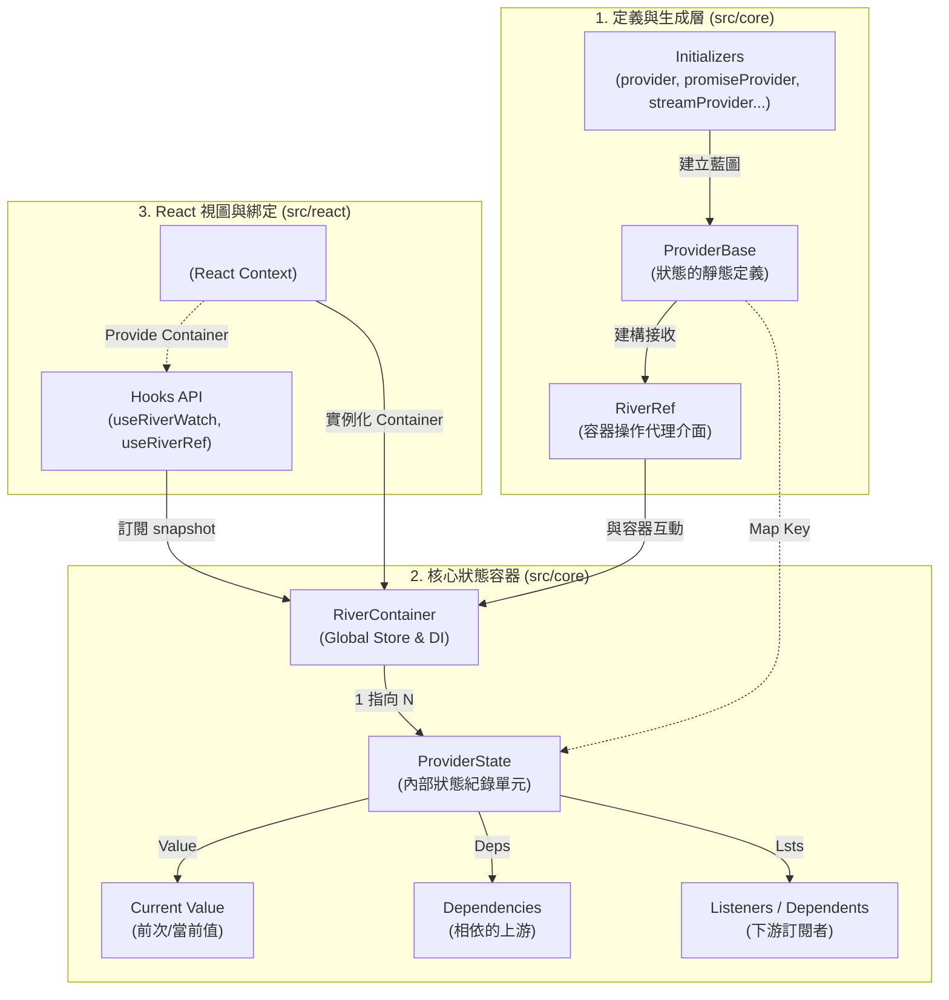
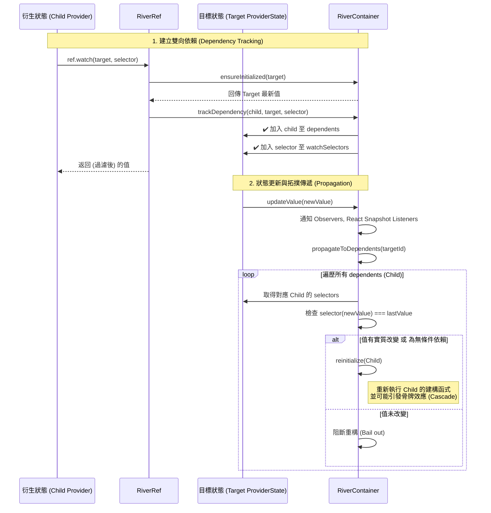
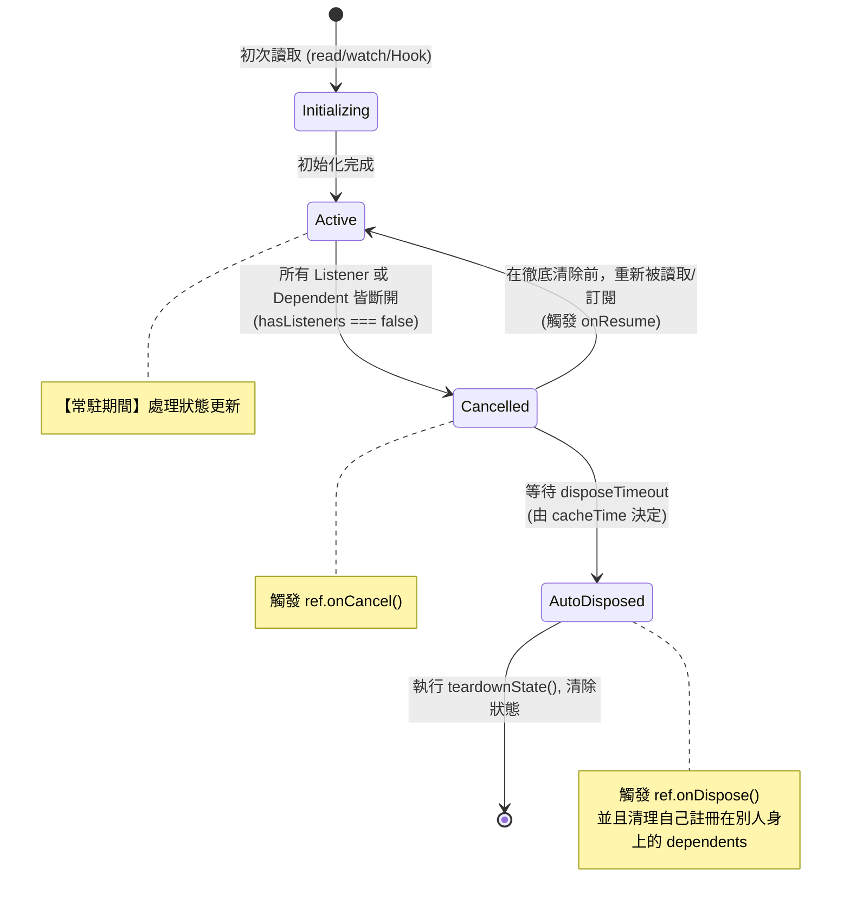

# React River 系統架構與核心機制解析

這份文件梳理了 **React River** 專案的核心架構、模組關係，以及深度的狀態追蹤與監聽機制 (Container & Ref Listening 機制)。

---

## 一、系統核心架構圖

React River 的設計理念借鑒了 Flutter 生態系中的 Riverpod，將「狀態定義 (Providers)」和「狀態儲存 (Container)」分離，並由 React 負責視圖層的綁定。

## 二、🔍 Ref vs RiverRef：操作介面的區別

為了確保狀態流向的嚴謹性，框架將「Provider 內部」與「React UI 元件」的操作介面分開，它們雖然共享相似的方法，但「能力」與「職責」完全不同：

| 特性 | **`Ref`** (Provider 內部) | **`RiverRef`** (React UI 元件) |
| :--- | :--- | :--- |
| **來源** | `createRef()` / `provider((ref) => ...)` | `useRiverRef()` |
| **職責** | **定義邏輯** 與 **建立反應式鏈結** | **事件處理** 與 **命令式操作** |
| **`ref.watch()`** | **✔️ 有** (核心能力：建立 Provider 依賴樹) | **❌ 無** (UI 應使用 `useRiverWatch`) |
| **`ref.read()`** | ✔️ 有 | ✔️ 有 |
| **`ref.set()`** | ❌ 無 (需透過 `notifier.state`) | **✔️ 有** (直接指令式更新) |
| **`listen()`** | **✔️ 自動清理** (綁定 Provider 生命週期) | **⚠️ 手動清理** (回傳 unsub 需自行處理) |
| **生命週期** | 支援 `onDispose`, `onCancel` 等掛鉤 | ❌ 無 (應使用 `useEffect`) |

---

## 三、深度解析：Container 與 Ref 監聽機制

React River 最強大的地方在於它的 **有向無環圖 (DAG) 依賴追蹤** 以及 **精細渲染控制 (Fine-Grained Reactivity)**。這主要由 `ref_factory.ts` 與 `container.ts` 協作完成。

### 1. `ref.watch` 與拓撲依賴更新 (Propagation)

當在一個 Provider 中透過 `ref.watch(targetProvider, selector)` 監聽另一個狀態時，框架不僅僅是取值，而是在兩個 Provider 之間建立起橋樑：

1. **依賴建立**：`ref.watch` 會將 `Child` 記錄到 `Target` 的 `dependents` Set 中，同時將 `Target` 記錄到 `Child` 的 `dependencies` Set 中。
2. **精細選取 (Selectors)**：若有傳遞 `selector`，會額外將 Selector 記錄在 `Target` 的 `watchSelectors` Map 裡。
3. **拓撲更新**：當 `Target` 狀態改變 (`updateValue`) 時，`RiverContainer` 會主動遍歷所有的 `dependents` (`propagateToDependents`)。
4. **Bail-out 阻斷更新**：在更新每一個 dependent 前，會比對 `selector(newValue) === lastValue`。如果值沒有實質變化，**就會跳過該從屬節點的重構 (Bail out)**，大幅節省效能。

#### 💡 Select 的運作原理
當你使用 `ref.watch(provider, (val) => val.part)` 時：
- `RiverContainer` 會在 `ProviderState.watchSelectors` 中紀錄這個 Selector。
- 當上游 Provider 更新時，Container 會遍歷所有 Dependents。
- 針對有 Selector 的 Dependent，它會執行 `selector(newValue)` 並與上一輪紀錄的 `lastValue` 比對。
- 這不僅僅是 React 層面的 `memo` 優化，而是從 **Dependency Graph 拓撲層面** 就阻斷了更新傳遞。

### 2. 非同步狀態與 `provider.promise` 機制

針對 `PromiseProvider`、`ObservableProvider`、`StreamProvider` 或 `AsyncNotifierProvider`，框架提供了 `.promise` 存取器（稱為 `PromiseAccessor`）。

#### 運作邏輯：
- `PromiseAccessor` 本身是**無狀態 (Stateless)** 的 Provider。
- 當你 `watch` 或 `read` `provider.promise` 時，Container 會動態地將父級的 `AsyncValue<T>` 轉化為一個 `Promise<T>`。
- **自動解構與追蹤**：如果 `AsyncValue` 處於 `data` 狀態，Promise 會立即 resolve；若處於 `loading`，則會返回一個在資料抵達時才會 resolve 的 Promise。
- **與 Select 結合**：`ref.watch(provider.promise, (data) => data?.id)` 甚至允許你針對非同步結果進行過濾，返回一個只在特定欄位變化時才 resolve 的新 Promise。

### 3. `ref.listen` vs `ref.watch`

- **`ref.watch(target)`**: 用於建立 **結構性依賴**。當 Target 改變時，會呼叫 `reinitialize` **重新建構 / 執行** 當前的 Provider 函式。
- **`ref.listen(target, callback)`**: 用於建立 **副作用依賴** (如呼出 Toast 提示)。當 Target 改變時，只是觸發 callback，**不會** 將自身加入到 Target 的 `dependents` 中，因此不會觸發自身重構。
  *(原始碼機制：`trackListenDependency` 僅向自己的 `dependencies` 登記，不寫入對方的 `dependents`)*

### 4. 生命周期與 Auto Dispose 回收機制

`ProviderState` 的存在與否，完全取決於**有沒有人依賴它**（即 `hasListeners` 的布林值）。
`hasListeners` 會檢查：React Hooks (`snapshotListeners`) + 監聽回呼 (`valueListeners`) + 依賴它的上層狀態 (`dependents`) 數量。

如果全空了，就會進入自動卸載 (Auto Dispose) 流程：

- **`teardownState`**: 當真正進入 Dispose 時，不僅會清空自己的值，還會連帶解開自己對其他 Provider 的依賴關聯（`depState.dependents.delete(id)`）。這可能會引發連鎖效應（Cascade Auto Dispose），讓沒有其他依賴的頂層狀態跟著被資源回收。
